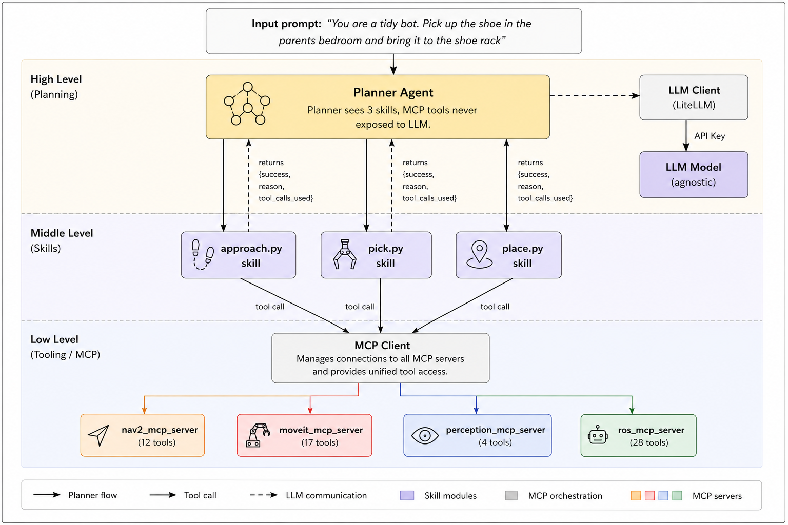

# Skill-based architecture


A deterministic-skills agentic architecture for long-horizon mobile-manipulation tasks on a [Summit XL](https://github.com/icclab/icclab_summit_xl) mobile manipulator (UR5 + Robotiq 2F-140) using ROS 2 Jazzy. Inspired by the CaP-X programmatic skill-abstraction pattern (Fu et al., 2026), implemented as a deliberately less-effort variant: small Python skills wrap the canonical MCP tool sequences for `approach`, `pick`, and `place`, and a planner LLM decides which skill to call next.





## Short Demo

https://github.com/user-attachments/assets/59f5b0d4-e723-47ab-bc2b-48469d949937

Originally built as one of three architectures compared in a BA thesis on "where the policy should live" in agentic robotics; released so others can reuse the pattern.

The headline claim: ~60 MCP tools across 4 servers are never exposed to the planner LLM. The planner sees exactly 3 skill schemas. All low-level decisions (which MCP tool, in what order, with what arguments, with what error handling) are absorbed by deterministic Python.


## Comparison-axis position

| Architecture | Where the policy lives | Planner LLM |
|---|---|---|
| [Single-agent](https://github.com/anthropics/claude-code) | LLM context, raw MCP tool surface | Frontier (e.g. Claude Opus) |
| [Multi-agent](https://github.com/michaljohnson/multi_agent) | Orchestrator + 3 LLM sub-agents, narrow MCP subsets per agent | Frontier (e.g. Claude Opus) |
| **Skill-based** | **Inside Python skills, hidden from the LLM** | **Small open-weights or frontier — both supported** |

The smaller-model + smarter-skills pairing is this architecture's design point, not a confound. Any LiteLLM-supported model works; see `.env.example`.

Validated end-to-end with two planner sizes on the same pick-and-place task:

- a small open-weights model with a **16k** context window, and
- a frontier model with a **131k** context window.

Both completed the task successfully. The planner emits one tool call per turn over a short conversation, so context length is not the binding constraint — the deterministic skills absorb the long-horizon reasoning load that would otherwise push context.

## Requirements

- Python 3.10+
- `litellm`, `python-dotenv`, an `mcp` Python client (any FastMCP-style streamable-http client works)
- One or more MCP servers exposing the tool families this code expects:
  - [**nav2**](https://github.com/michaljohnson/nav2_mcp_server) — drive, navigate-to-pose, spin, lifecycle, `approach_target`
  - [**moveit**](https://github.com/michaljohnson/moveit-mcp-server) — plan/execute, IK, planning scene
  - [**perception**](https://github.com/michaljohnson/perception_mcp_server) — segmentation, top-down grasp/place pose, look
  - [**ros**](https://github.com/robotmcp/ros-mcp-server) — generic topics, services, actions, parameters
- An LLM provider (Anthropic API, OpenAI-compatible vLLM, OpenAI, Ollama — anything LiteLLM supports)

The MCP servers are not part of this package; you bring your own. The architecture's contract with them is "any tool-calling LLM should be able to use them," which is exactly what an MCP server provides.

## Repository layout

```
skill_based/
  main.py                  CLI entry (--task / --test-{pick,place,approach})
  planner.py               planner LLM agent + skill dispatch
  planner.md               planner system prompt (loaded by planner.py)
  skills/                  deterministic Python skills (the architecture's middle layer)
    __init__.py
    approach.py            nav2 + four-phase find-and-approach sequence
    pick.py                grasp pipeline (returns held_object_height_m)
    place.py               release pipeline with three-mode dispatch (container | surface | floor)
  utils/                   shared low-level helpers used by 2+ skills
    __init__.py            arm reset, /odom stillness wait, SAM3 fallback prompts, seg-status parsing
  clients/                 external system adapters (the architecture's low-layer interface)
    __init__.py
    llm.py                 LiteLLM wrapper with Hermes-XML tool-call fallback
    mcp.py                 MCP connection manager
  docs/
  .env.example             environment-variable template
  README.md                this file
```

## Quick start

```bash
cp skill_based/.env.example skill_based/.env
# edit .env: pick a planner LLM (Anthropic, OpenAI-compatible local vLLM, OpenAI, ...)

# Single-skill smoke tests (assume robot is pre-positioned for pick/place):
python3 -m skill_based.main --test-pick "red coke can"
python3 -m skill_based.main --test-place "trash bin" --object-name "red coke can" --mode container --object-height-m 0.12
python3 -m skill_based.main --test-approach "living room" --next-action pick --object-name "wooden coffee table"

# Full planner loop:
python3 -m skill_based.main --task "pick up the red coke can in the kitchen and place it on the wooden surface in the living room"
```

### Place modes

The `place` skill dispatches on a required `mode` argument:

| Mode        | Trigger words                       | `target_location` semantics       |
|-------------|-------------------------------------|-----------------------------------|
| `container` | bin / trash / basket / box          | the container itself              |
| `surface`   | table / shelf / rack / counter      | the elevated flat surface         |
| `floor`     | "next to X on the floor" / "beside" | the **reference object** (not "floor") |

The `pick` skill measures the held object's height from its SAM3 bounding box and returns it as `held_object_height_m`. The planner must forward that value into the subsequent `place` call (container mode ignores it; surface and floor need it for wrist-z math).

`.env` is loaded automatically via `python-dotenv` from the package root. Run from the parent directory of `skill_based/` so the package import resolves.

## How a turn works

1. The planner LLM receives the system prompt (`planner.md`), the user task, and three tool schemas (`approach`, `pick`, `place`).
2. The planner emits a tool call. LiteLLM routes it back through `clients/llm.py`. If the model is served by a vLLM without the Hermes tool-call parser flag, a client-side parser extracts the tool call from `message.content`.
3. `planner.py` dispatches the call to the matching deterministic skill in `skills/`.
4. The skill runs its canonical MCP-tool sequence (typically 5–20 calls), returns `{success: bool, reason: str, tool_calls_used: int, ...}`.
5. The planner sees the structured result and decides the next skill, or returns a final report.

The planner does NOT see the underlying MCP tool surface. The skills do not call the LLM.

## Adapting to your environment

The skills assume specific MCP tool names (e.g. `perception__segment_objects`, `nav2__approach_target`, `moveit__plan_and_execute`). If your MCP servers expose different names, edit the calls inside `skills/*.py`. The architectural pattern (planner → deterministic skill → MCP tool) is independent of the specific tool names; only the strings need updating.

The hardcoded entry-pose table in `skills/approach.py` is keyed to a particular simulated home environment. Replace with your own room/area coordinates.

## Design decisions

- **No CaP-X faithful reimplementation.** A faithful CaP-X reproduction would require extracting every MCP server tool as a native Python function. This architecture uses MCP tools internally inside the skills while still hiding them from the planner LLM — a related-but-distinct design point that keeps the architecture portable across MCP server implementations.
- **Planner is intentionally weak by default.** Small open-weights models (e.g. Qwen 3.6 27B AWQ-INT4) are sufficient because the deterministic skills absorb the per-step reasoning load. The planner only picks from three skills and supplies structured arguments.
- **Failures escalate, do not loop.** If a skill fails persistently, the planner returns overall failure rather than retrying indefinitely. This is the inverse of single-agent and multi-agent designs, which can iterate freely on tool errors.
- **Verification is baked into the skills, not the prompt.** Pick verifies via `/gripper/status`. Place verifies via post-release object visibility. These checks are sufficient for many cases but let some false-success cases through; see code comments in `skills/pick.py` and `skills/place.py` for the trade-offs.

## Citing

If you build on this work, please cite the BA thesis it originated from (forthcoming). The CaP-X paper that inspired the design is:

> Fu et al. (2026). *Code as Policies — extended skill library variant.*
